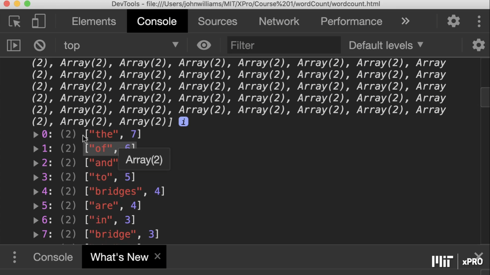

# Instructions on Word Count Exercise:

Time to get started with the **word count exercise**. Start by **removing the punctuation** and **capitalization** in order to **clean up the string**. Next, you will **split it** into an **array** at the **spaces between** the **words**. You will then use an **object** to store **key value pairs** for **each word**. This will *help you produce* an **ordered list** of the **most common words**. You can start by **completing this assignment** in [NextTech](https://classroom.emeritus.org/courses/1173/assignments/47167), and then you can **work through it** on **your machine** using the **starter files** from the [Introduction and Instructions](https://classroom.emeritus.org/courses/1173/pages/module-6-introduction-and-instructions-5-00) page.

So, in this exercise, we're given a **long string of words**, and then we **need to count** the **most common words**. And what we need to do is to figure out, first, we need to **remove the periods** and the **commas**. Otherwise, they're going to be **attached to the words**.

I'm going to use ```wordArray = text.split(" ")```; So, *this should pick out* **each word separately**. Now, we also need to **remove capital letters**. Otherwise, **words** with **capital letters** will be *different* to the **same word** if it starts with a **small letter**.


So, that's the **first thing** that I need you to do is to **clean up this string**. And then finally **split it** on the ```spaces``` into **an array**. So, now we've got a **long array of words**. So, here's that array. So, it's a ```(134)``` long, and we've **removed the commas**; we've **removed the periods**, et cetera.


So, **once you've done that**, now what we need to do is we're going to use an ```object``` to **store the words**. So, we're going to use ```key``` and ```value``` pairs. So, the ```key``` for **each item** is the **actual word** itself. So, here we are. We're going to create ```wordCount```. It's an ```object```, and the ```key``` is the **word**. And then, we're going to **give a value** to that **word**. And if it **hasn't appeared before**, if it **doesn't appear as an item**, i.e., it's ```null```, we give it a value ```1```. If it **does appear already**, we just **increment its value** by ```1```.


Then finally, what I want you to do is to produce an **ordered list** of those **words** with the **most common word** at the **top**. To do that, you need to use an ```array```. It's best to turn that object ```wordCount``` into an ```array```. And how to do that, ```object.entries``` will give you an **array of arrays**.


And in the **arrays**, there's going to be **two things**. Let me show you. So, here, for example, is that **array**. You will see that these are the **most common**. And we got ```93``` out of these **arrays of two**.


So, now I want you to **sort** it's **not going to be** in the **right order**. I've already **sorted this**, but I want you to do that as well.




So, good luck with this exercise. And this has **got many uses**. Basically, the whole of **Google's page ordering** *was based on* **most common pages** that they **had to order**, just like this.